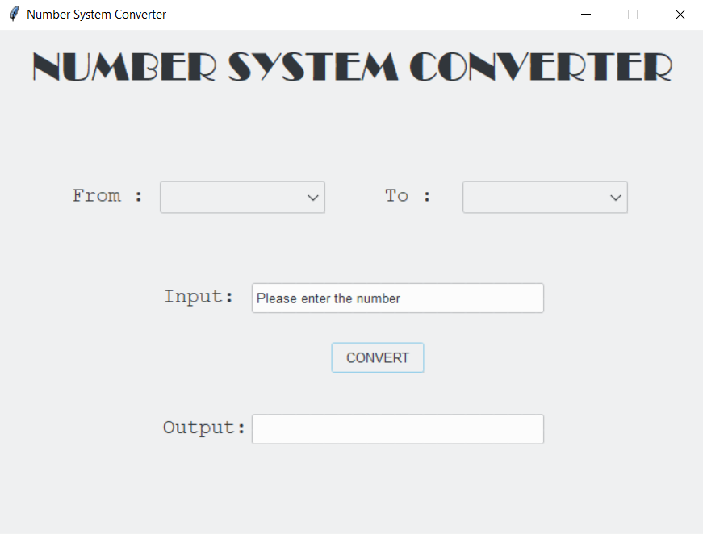

# Radix Converter

A simple app that allows the user to convert numbers between various systems such as Binary, Decimal, Octal, and Hexadecimal. 


## Table of Contents
- [Purpose](#purpose)
- [Technologies and Libraries Used](#technologies-and-libraries-used)
- [Setup](#setup)
- [Repository Information](#repository-information)
- [Usage](#usage)


## Purpose
This project was created to learn more about how different number systems work and how to convert numbers between them. It also helped me learn more about the tkinter library and how to create a GUI with it. I learned how important and helpful radix systems are in the world of computers and how they are used to convert our messages into binary numbers that the computer can understand.


## Technologies and Libraries Used
- Programming Language
    - Python
- Libraries
    - tkinter
    - ttkthemes
    - tkinter.scrolledtext
    - string


## Setup
Make sure to git clone this repository. After cloning, make sure the latest version of Python and all mentioned packages are installed and the project is ready for use!


## Repository Information
This repository consists of a single main.py Python file. The file has the following functions:
- convert() - converts numbers between different radix systems
- main() - creates the GUI and calls the convert() function
- mainloop() - runs the GUI


## Usage



To run the program, open the terminal and navigate to the directory where the main.py file is located. Then run the following command:
```
python main.py
```

To use the application, follow the steps below:
1. Enter the number you want to convert in the input box
2. Select the radix system of the number you entered
3. Select the radix system you want to convert the number to
4. Click on the convert button
5. The converted number will be displayed in the output box

